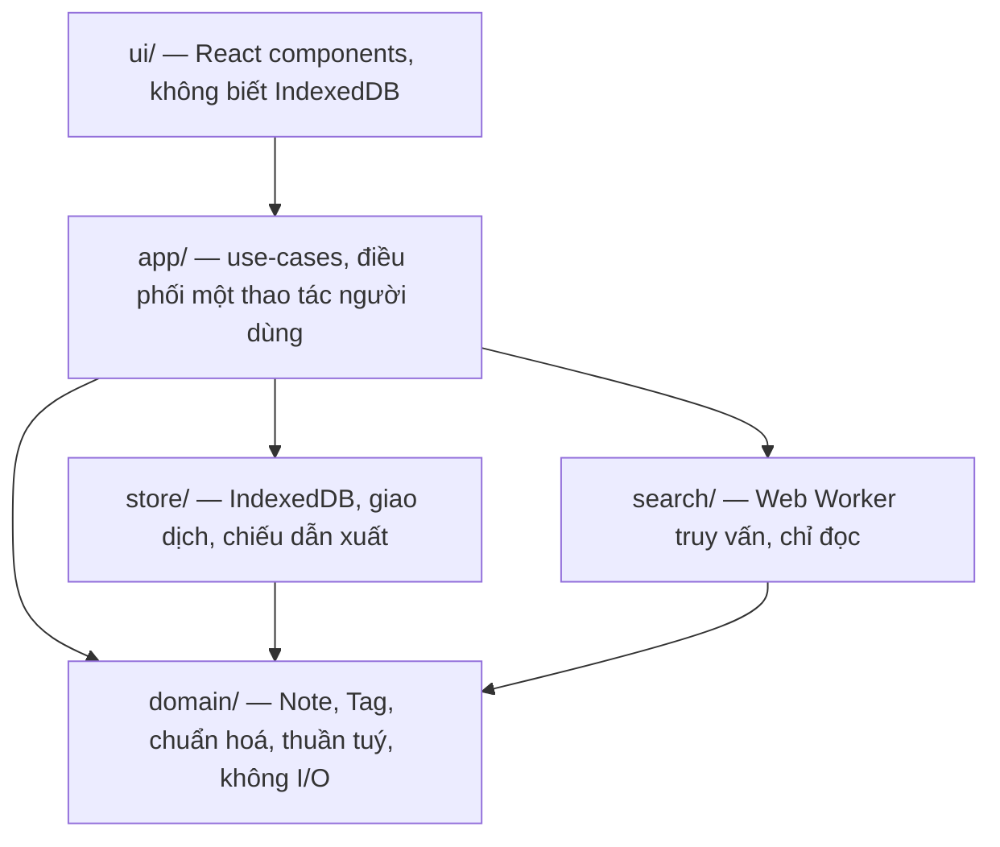
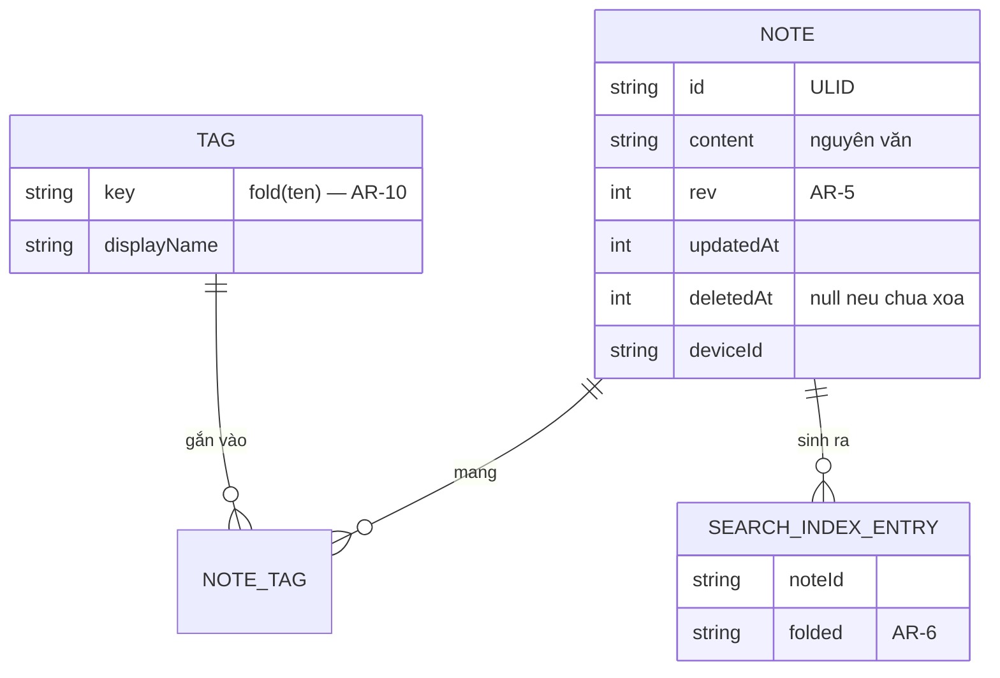
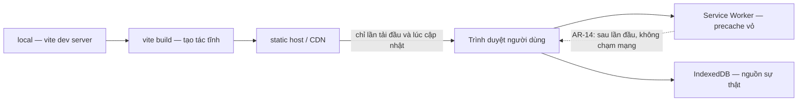

# Kiến trúc — Sổ tay ghi chú

Tài liệu này chốt **những bất biến** mà mọi story phải tuân thủ. Nó không mô tả lại mã nguồn: khi mã đã tồn tại, mã sở hữu chi tiết. Mỗi quyết định có ID `AR-n` ổn định — story tham chiếu bằng ID, không diễn giải lại.

## Mô hình thiết kế

**Local-first layered SPA, một đường ghi duy nhất + chiếu đọc dẫn xuất.**

Toàn bộ trạng thái sống trong trình duyệt. Mọi thay đổi dữ liệu đi qua đúng một cửa (`store/`), và các cấu trúc đọc nhanh — Chỉ mục tìm kiếm, chỉ mục Thẻ — là **chiếu dẫn xuất** được cập nhật trong cùng giao dịch với dữ liệu gốc, không bao giờ được sửa độc lập.

Chọn mô hình này thay vì layered thuần vì Chỉ mục tìm kiếm là trạng thái dẫn xuất: nếu không có luật "một đường ghi, chiếu đi theo trong cùng transaction", mỗi story chạm vào Ghi chú đều có thể để lại chỉ mục lệch, và lỗi chỉ lộ ra ở FR-5 chứ không ở story gây ra nó.

Bốn tầng, ánh xạ thẳng vào thư mục:



## Bất biến và luật

### AR-1 — Một đường ghi duy nhất

- **Binds:** FR-1, FR-2, FR-3, FR-8, FR-10, FR-11
- **Prevents:** Hai story cùng sửa Ghi chú qua hai đường khác nhau; một đường quên cập nhật chiếu dẫn xuất và Chỉ mục tìm kiếm lệch âm thầm.
- **Rule:** Mọi thay đổi dữ liệu bền vững đi qua các hàm trong `store/`. Không component, hook hay use-case nào được mở giao dịch IndexedDB trực tiếp. Mỗi hàm ghi nhận toàn bộ thay đổi của một thao tác người dùng và commit trong **một** giao dịch `readwrite` duy nhất, bao gồm cả chiếu dẫn xuất. `store/` sở hữu toàn vẹn tham chiếu: sau mỗi giao dịch **không được còn bản ghi `NoteTag` mồ côi** — không trỏ tới `Note` đã bị xoá vĩnh viễn, không trỏ tới `Tag` đã bị xoá hoặc đã bị gộp (AR-10).

### AR-2 — Hướng phụ thuộc một chiều

- **Binds:** all
- **Prevents:** Logic nghiệp vụ rò vào component; tầng dưới `import` ngược lên tầng trên và tạo vòng phụ thuộc mà mỗi story lại phá theo một kiểu.
- **Rule:** Phụ thuộc chỉ đi theo chiều `ui/ → app/`, rồi `app/ → domain/`, `app/ → store/`, `app/ → search/`, và `store/ → domain/`. `domain/` không `import` bất cứ thứ gì ngoài chính nó và thư viện chuẩn. `store/`, `search/`, `domain/` không được `import` React. Vi phạm là lỗi build, không phải góp ý review.

### AR-3 — Kho cục bộ là nguồn sự thật duy nhất, có phiên bản schema

- **Binds:** FR-11, NFR-4, NFR-5; ràng buộc dữ liệu ở PRD §6
- **Prevents:** Trạng thái chỉ nằm trong bộ nhớ mà không dẫn xuất được từ IndexedDB (mất khi tab bị thu hồi); hai story nâng schema theo hai cách và kho của người dùng thật kẹt giữa hai phiên bản.
- **Rule:** IndexedDB là nguồn sự thật; mọi trạng thái React phải dẫn xuất được từ nó và tái tạo được sau khi tải lại. Schema mang số phiên bản nguyên tăng dần; mỗi thay đổi schema là một hàm migration **tiến, không lùi**, chạy trong `onupgradeneeded`, và phải chạy được trên kho đã có dữ liệu. Không xoá kho để "làm sạch".

### AR-4 — Lưu tự động: debounce 500ms + flush bắt buộc

- **Binds:** FR-2, NFR-4, SM-4
- **Prevents:** Mỗi màn hình soạn thảo tự chọn ngưỡng debounce riêng; nội dung đang gõ mất khi tab bị hệ điều hành thu hồi trước lần ghi kế tiếp.
- **Rule:** Nội dung đang soạn được ghi vào Kho cục bộ sau **500ms** ngừng gõ (`[ASSUMPTION]` — là núm chỉnh, chốt lại bằng AR-16 nếu đo thấy tốn). Ngoài ra, ghi **bắt buộc và đồng bộ hoá ngay** trên `visibilitychange → hidden` và `pagehide`. Không có nút Lưu; không thao tác nào của người dùng được chờ lần ghi này.

### AR-5 — Không dùng đồng hồ tường để phán quyết thứ tự

- **Binds:** FR-2, FR-3, FR-15 (khớp nối), AR-11, AR-18
- **Prevents:** Đồng hồ hai Thiết bị lệch nhau khiến bản sửa mới bị coi là cũ và bị ghi đè — mất chữ người dùng, vi phạm NFR-4.
- **Rule:** Mỗi bản ghi mang một bộ đếm `rev` nguyên, tăng đúng 1 mỗi lần ghi. **Thứ tự và tính "mới hơn" chỉ được phán quyết bằng `rev`, không bao giờ bằng `updatedAt`.** `updatedAt` chỉ dùng để hiển thị và sắp xếp cho người đọc (FR-4, AR-9).

### AR-6 — Một hàm chuẩn hoá văn bản duy nhất

- **Binds:** FR-6, FR-5, FR-8, FR-9, FR-10, AR-7, AR-10
- **Prevents:** Tìm kiếm và gộp Thẻ chuẩn hoá khác nhau, nên `ca phe` khớp nội dung nhưng không khớp Thẻ; hoặc `đ` bị bỏ sót ở một chỗ và `Dự Án` tách thành hai Thẻ.
- **Rule:** Đúng một hàm `fold(s)` trong `domain/text.ts` phục vụ mọi việc đối sánh: NFD → loại các dấu kết hợp `U+0300–U+036F` → **ánh xạ riêng `đ→d`, `Đ→d`** (NFD không tách được `đ`) → `toLowerCase()`. Không nơi nào được viết logic chuẩn hoá thứ hai. Nội dung gốc luôn được lưu nguyên văn; chuỗi đã fold là khoá đối sánh lưu song song, không thay thế.

### AR-7 — Chỉ mục nằm trong kho, cập nhật tăng dần, không bao giờ dựng lại lúc khởi động

- **Binds:** FR-5, FR-9, NFR-1, NFR-2
- **Prevents:** Mâu thuẫn NFR-1 ↔ NFR-2 mà `addendum.md` §B nêu: chỉ mục dựng lúc khởi động thì truy vấn nhanh nhưng phá ngưỡng mở ứng dụng 1 giây ở quy mô 10.000 Ghi chú.
- **Rule:** Chỉ mục tìm kiếm là dữ liệu bền vững trong IndexedDB, được cập nhật **tăng dần trong cùng giao dịch với Ghi chú** (AR-1). Khởi động ứng dụng **không được** quét toàn kho hay dựng lại chỉ mục. Dựng lại toàn phần chỉ xảy ra trong migration của AR-3, có chỉ báo tiến trình, và không nằm trên đường tới hạn của NFR-1.

### AR-8 — Truy vấn chạy trong Web Worker, sẵn sàng tăng dần

- **Binds:** FR-5, FR-6, FR-9, NFR-1, NFR-2, NFR-3
- **Prevents:** Truy vấn chạy trên luồng chính làm rớt khung hình khi gõ (NFR-3); hoặc chờ chỉ mục sẵn sàng rồi mới vẽ giao diện (NFR-1).
- **Rule:** Mọi việc đối sánh Truy vấn chạy trong một Web Worker, khởi tạo **sau lần vẽ đầu tiên**. Giao diện hiển thị và cho gõ ngay khi chưa có worker; ô tìm kiếm là một **trạng thái sẵn sàng tăng dần** ("đang chuẩn bị tìm kiếm") chứ không phải một màn hình chờ. Luồng chính giao tiếp với worker chỉ qua `postMessage`; worker **chỉ đọc** IndexedDB, không bao giờ ghi (AR-1). Thêm hai điều kiện, vì thiếu chúng thì hai story vẫn tuân thủ mà kết quả vẫn lệch nhau:
  - **Thông báo, không hỏi vòng.** Sau khi một giao dịch của AR-1 commit, `store/` đẩy danh sách id đã đổi sang worker. Worker **không bao giờ tự hỏi vòng** IndexedDB để phát hiện thay đổi.
  - **Worker đánh giá trọn vẹn một truy vấn.** Bộ lọc Thẻ, chuỗi Truy vấn và thứ tự ở AR-9 đều do worker xử lý; nó trả về một **danh sách id đã sắp xếp sẵn**. Luồng chính không lọc lại, không sắp xếp lại, không giao nhau lại.

### AR-9 — Xếp hạng kết quả xác định

- **Binds:** FR-7, FR-9; mặc định kiến trúc cho OQ-4
- **Prevents:** Hai story sắp xếp kết quả khác nhau; cùng một Truy vấn trên cùng dữ liệu cho thứ tự khác nhau giữa hai lần chạy, làm hỏng điều kiện kiểm thử của FR-7.
- **Rule:** Mặc định: `updatedAt` giảm dần, phá hoà bằng `id` tăng dần — **toàn phần và xác định**, không có hai bản ghi nào hoà. Đây là mặc định rẻ để PM đổi ở OQ-4: điểm liên quan, nếu được chốt, thêm vào làm khoá sắp xếp **đứng trước**, giữ nguyên `(updatedAt, id)` làm phần phá hoà.

### AR-10 — Định danh Thẻ là tên đã chuẩn hoá

- **Binds:** FR-8, FR-9, FR-10
- **Prevents:** `Dự Án X`, `dự án x`, `dự an x` trở thành ba Thẻ khác nhau — chính điều FR-8 cấm; và một story chống trùng bằng kiểm tra riêng còn story khác thì không.
- **Rule:** Khoá chính của Thẻ là `fold(tên)` theo AR-6. Tên hiển thị là lần gõ đầu tiên, lưu riêng. Gắn một Thẻ có `fold` trùng Thẻ đã có sẽ **dùng lại** Thẻ đó, không tạo mới — chống trùng là hệ quả của cấu trúc, không phải một bước kiểm tra ai đó có thể quên. Đổi tên Thẻ (FR-10) đổi cả khoá; nếu khoá mới đã tồn tại thì đó là **gộp**, và phải là một giao dịch duy nhất.

### AR-11 — Xoá mềm bằng cờ, dọn rác lười

- **Binds:** FR-3, FR-4, FR-5
- **Prevents:** Ghi chú đã xoá vẫn lọt vào danh sách hoặc kết quả Truy vấn vì mỗi đường đọc tự nhớ lọc; hoặc một tác vụ dọn rác nền chạy lúc khởi động và ăn vào NFR-1.
- **Rule:** Xoá đặt `deletedAt` và **gỡ bản ghi khỏi Chỉ mục tìm kiếm ngay trong cùng giao dịch** — nhờ đó Ghi chú trong Thùng rác biến mất khỏi mọi đường đọc theo cấu trúc, không nhờ bộ lọc lặp lại. Xoá mềm **chỉ được** đụng tới `deletedAt` và chiếu chỉ mục: nội dung `Note` và các bản ghi `NoteTag` giữ nguyên, nếu không thì khôi phục không trả lại đúng Thẻ như FR-3 đòi. Dọn rác vĩnh viễn (30 ngày) chạy **lười, sau lần vẽ đầu tiên**, theo lô, không chặn gì. Ngưỡng 30 ngày tính theo `deletedAt` cục bộ — đúng cho MVP một Thiết bị; xem lại khi Đồng bộ về (AR-5, AR-18).

### AR-12 — Ghi chú không có trường tiêu đề riêng

- **Binds:** FR-4, FR-7; mặc định kiến trúc cho OQ-3
- **Prevents:** Một story thêm trường `title` còn story khác dẫn xuất từ dòng đầu, tạo hai nguồn sự thật cho cùng một thứ hiển thị.
- **Rule:** `Note` **không có** trường tiêu đề. Tiêu đề hiển thị là dòng đầu nội dung, dẫn xuất bằng một hàm thuần trong `domain/`. Nếu OQ-3 chốt là có tiêu đề riêng, đó là migration của AR-3 — rẻ vì hiện không có dữ liệu nào phải hoà giải.

### AR-13 — Dung lượng là trạng thái được theo dõi, không phải lỗi bất ngờ

- **Binds:** FR-17, NFR-4
- **Prevents:** Thao tác ghi đầu tiên thất bại vì hết dung lượng chính là lúc người dùng biết tin — đúng kịch bản mất dữ liệu mà FR-17 sinh ra để chặn.
- **Rule:** Gọi `navigator.storage.persist()` một lần trong phiên đầu (giảm nhẹ, **không** phải bảo đảm). Kiểm tra `navigator.storage.estimate()` khi khởi động và sau mỗi 50 lần ghi; cảnh báo khi còn dưới **10% hoặc 50MB, lấy giá trị lớn hơn** (`[ASSUMPTION]` — trình duyệt báo quota không nhất quán, để lộ ra làm hằng số chỉnh được). Cảnh báo phải dẫn thẳng tới thao tác xuất dữ liệu ở FR-16.

### AR-14 — Vỏ ứng dụng precache; mạng không nằm trên đường tới hạn

- **Binds:** FR-11, NFR-1, NFR-5
- **Prevents:** Một story thêm một lệnh gọi mạng (font, phân tích, kiểm tra phiên bản) vào đường khởi động và phá ngưỡng offline ở lần tải lại đầu tiên; hoặc service worker cũ phục vụ mã cũ trên schema đã migrate.
- **Rule:** Service worker precache toàn bộ vỏ ứng dụng, chiến lược **cache-first**. Ở MVP, ứng dụng **không thực hiện bất kỳ lệnh gọi mạng nào lúc chạy** — không CDN, không font ngoài, không endpoint đo đạc. Cập nhật phiên bản: service worker mới ở trạng thái chờ, người dùng được mời tải lại tường minh; **không** tự `skipWaiting` — mã mới chỉ nắm quyền sau khi tải lại, nên không bao giờ có mã cũ chạy trên schema mới.

### AR-15 — Lỗi ghi không bao giờ im lặng

- **Binds:** NFR-4, FR-2, FR-17, SM-4
- **Prevents:** Giao dịch IndexedDB bị huỷ (hết quota, kho bị thu hồi, khoá xung đột) mà giao diện vẫn hiện như đã lưu — người dùng đóng tab và mất chữ.
- **Rule:** Mọi hàm ghi trong `store/` trả về kết quả tường minh về thành công/thất bại; **không được nuốt lỗi**. Thất bại làm giao diện chuyển sang trạng thái lỗi nhìn thấy được, giữ nguyên nội dung trong bộ soạn thảo (không xoá, không rollback ô nhập), và đề nghị xuất dữ liệu (FR-16). Không có đường mã nào chỉ ghi log rồi đi tiếp.

### AR-16 — Bài đo dựng sẵn là cổng của NFR-1 và NFR-2

- **Binds:** NFR-1, NFR-2, NFR-3, SM-1, SM-2, AR-7, AR-8
- **Prevents:** Chọn thuật toán tìm kiếm bằng suy đoán; hoặc mỗi story tự đo theo cách khác nhau nên các con số không so sánh được với nhau.
- **Rule:** Một bộ dữ liệu tổng hợp **10.000 Ghi chú** (sinh xác định, có hạt giống cố định) và một bài đo dựng sẵn nằm trong repo, đo thời gian mở ứng dụng và độ trễ Truy vấn ở phân vị 95. **Mọi story chạm vào `store/` hoặc `search/` phải chạy nó.** Đây là cổng chốt thuật toán tìm kiếm: bắt đầu bằng cách rẻ nhất — quét chuỗi đã fold **bên trong worker** — và chỉ nâng lên chỉ mục ngược khi bài đo trượt NFR-2. Điều kiện đo (thiết bị tham chiếu) chưa chốt — OQ-6.

### AR-17 — Điều hướng trong một module, không thư viện router

- **Binds:** FR-4, FR-9, NFR-1
- **Prevents:** Hai story mã hoá trạng thái màn hình theo hai kiểu (một dùng URL, một dùng state cục bộ), khiến bộ lọc Thẻ đang bật không sống sót qua một lần tải lại.
- **Rule:** Trạng thái điều hướng — Ghi chú đang mở, Thẻ đang lọc, Truy vấn hiện tại — nằm **trong URL** qua History API, đọc/ghi chỉ trong `app/route.ts`. Không thêm thư viện router: bộ URL là hữu hạn và nhỏ, còn ngân sách 1 giây của NFR-1 trừng phạt mọi kilobyte.

### AR-18 — Mọi bản ghi mang sẵn khớp nối đồng bộ ngay từ MVP

- **Binds:** FR-13, FR-14, FR-15 (khớp nối, không phải thiết kế); AR-3, AR-5
- **Prevents:** Gắn định danh bản ghi vào dữ liệu chỉ-nằm-cục-bộ **sau khi đã phát hành** là một cuộc migration trên từng thiết bị của từng người dùng, không có server nào để chạy hộ.
- **Rule:** Kể từ story đầu tiên, `Note` và `Tag` mang: `id` (ULID, sinh ở client, sắp xếp được theo thời gian, không cần điều phối), `rev` (AR-5), `deviceId` (sinh một lần cho mỗi Thiết bị, lưu trong kho). Các trường này được ghi và giữ nguyên ngay cả khi Đồng bộ chưa tồn tại. **Không được thiết kế thêm gì về Đồng bộ** cho tới khi OQ-1 chốt — cụ thể là không giao thức, không endpoint, không mô hình xung đột.

### AR-19 — Tạo tác tĩnh, không server ở MVP

- **Binds:** all; ràng buộc chi phí ở PRD §6
- **Prevents:** Một story kéo vào một thành phần chạy phía server (hàm serverless, endpoint đo đạc, proxy cấu hình) và phá cả cam kết "không phát sinh chi phí hạ tầng khi chưa bật Đồng bộ" lẫn ngưỡng offline ở NFR-5.
- **Rule:** Bản build là **tạo tác tĩnh thuần** phục vụ từ một static host bất kỳ; MVP **không có thành phần phía server nào**. Hai môi trường: `local` (dev server) và `production` (bản tĩnh đã build). Không có biến môi trường nào chứa bí mật — không có bí mật nào để chứa. Tài sản có băm trong tên và bất biến; `index.html` và service worker không được cache lâu.

### AR-20 — Bản xuất là ảnh chụp đầy đủ, tự mô tả

- **Binds:** FR-16, FR-17, NFR-4
- **Prevents:** Bản xuất bỏ sót Thẻ, bỏ sót Ghi chú trong Thùng rác, hoặc mang theo cấu trúc chiếu nội bộ — khiến đường thoát hiểm chống mất dữ liệu duy nhất lại không khôi phục đủ, và khiến chức năng Nhập ở v2 không có hình dạng ổn định để bám vào.
- **Rule:** Bản xuất là **một tệp JSON** chứa: số phiên bản schema (AR-3), toàn bộ `Note` gồm cả bản đang trong Thùng rác (kèm `deletedAt`), toàn bộ `Tag` với tên hiển thị, và các liên kết `NoteTag`. **Không** xuất chiếu dẫn xuất — chỉ mục tìm kiếm và mọi khoá đã fold đều dựng lại được (AR-6, AR-7). Nội dung Ghi chú xuất nguyên văn, không escape thêm ngoài JSON. Bản xuất phải đọc hiểu được mà không cần chính ứng dụng này.

## Quy ước nhất quán

| Concern | Convention |
| --- | --- |
| Đặt tên thực thể | `Note`, `Tag`, `NoteTag`, `SearchIndexEntry` — tiếng Anh trong mã, tiếng Việt trong giao diện. Bảng thuật ngữ PRD §3 ↔ tên thực thể là ánh xạ 1-1, không có từ đồng nghĩa. |
| Đặt tên tệp/module | `kebab-case.ts`; một use-case một tệp trong `app/`; thư mục theo tầng ở AR-2, không theo tính năng. |
| ID | `id` là ULID chuỗi 26 ký tự (AR-18). Khoá Thẻ là `fold(tên)` (AR-10). Không dùng số tự tăng. |
| Thời gian | Số nguyên epoch mili giây, UTC. Chỉ để hiển thị và sắp xếp — **không bao giờ để phán quyết thứ tự** (AR-5). |
| Trạng thái | `useSyncExternalStore` trên một store duy nhất trong `store/`. Không thư viện quản lý trạng thái; không context lồng nhau giữ dữ liệu miền. |
| Lỗi | Hàm ghi trả về kết quả tường minh (AR-15). Lỗi hiển thị được cho người dùng, không phải chuỗi kỹ thuật. Không `console.error` rồi đi tiếp. |
| Chuỗi hiển thị | Tiếng Việt, viết thẳng trong component. Không lớp i18n ở MVP (sản phẩm một ngôn ngữ). |
| Khả năng tiếp cận | Mọi thao tác dùng được bằng bàn phím; ô soạn thảo và ô tìm kiếm có nhãn; tương phản WCAG 2.1 AA (NFR-7). Là điều kiện chấp nhận của story, không phải một đợt dọn dẹp sau. |
| Kiểm thử | Logic `domain/` (nhất là `fold`, dẫn xuất tiêu đề) test đơn vị bắt buộc. `store/` test trên `fake-indexeddb`. Story chạm `store/`/`search/` chạy bài đo AR-16. |

## Stack

`[ASSUMPTION]` — phiên bản dưới đây **chưa được xác minh trực tuyến** (phiên chạy không có mạng ra ngoài). Chốt dòng chính, không chốt phiên bản chính xác: bước dựng dự án phải giải phiên bản hiện hành trong dòng đó và ghi vào lockfile; lockfile là nguồn sự thật kể từ đó.

| Name | Version |
| --- | --- |
| TypeScript | 5.x (`strict: true`, bắt buộc) |
| React | 19.x |
| Vite | 7.x |
| vite-plugin-pwa (Workbox) | 1.x |
| idb | 8.x |
| Vitest + fake-indexeddb | dòng hiện hành lúc dựng |

Không thêm: thư viện quản lý trạng thái, router, thư viện tìm kiếm, framework CSS, thư viện ngày giờ. Mỗi phụ thuộc bị bỏ đi là một kilobyte không ăn vào NFR-1 và một thứ không phải vá trong một ứng dụng không có server đứng sau.

## Hạt giống cấu trúc

### Thực thể lõi



`SEARCH_INDEX_ENTRY` là **chiếu dẫn xuất** (AR-1, AR-7): hình dạng bên trong của nó thuộc về mã và có thể đổi khi AR-16 buộc nâng thuật toán. Điều bất biến là nó được ghi cùng giao dịch với `NOTE` và không bao giờ dựng lại lúc khởi động.

### Triển khai và môi trường



Không có hộp nào ở phía server trong MVP (AR-19). Khi Đồng bộ về, nó vào sơ đồ này như một hộp **mới**, không phải bằng cách sửa đường đi hiện có — đó là điều AR-18 giữ chỗ sẵn.

### Cây nguồn

```text
src/
  ui/          # component React; không biết IndexedDB tồn tại
  app/         # use-case: mỗi thao tác người dùng một tệp; route.ts (AR-17)
  domain/      # Note, Tag, text.ts (fold — AR-6); thuần tuý, không I/O
  store/       # schema + migration (AR-3), giao dịch ghi (AR-1), chiếu (AR-7)
  search/      # worker truy vấn (AR-8); chỉ đọc
bench/         # bộ 10.000 ghi chú tổng hợp + bài đo (AR-16)
```

## Bản đồ năng lực → kiến trúc

| Năng lực (PRD) | Sống ở | Chịu sự chi phối của |
| --- | --- | --- |
| FR-1..FR-4 soạn thảo, danh sách | `app/`, `store/`, `ui/` | AR-1, AR-3, AR-4, AR-12, AR-15 |
| FR-3 thùng rác | `store/` | AR-11, AR-5 |
| FR-5..FR-7 tìm kiếm | `search/`, `store/` | AR-6, AR-7, AR-8, AR-9, AR-16 |
| FR-8..FR-10 thẻ | `domain/`, `store/` | AR-6, AR-10, AR-1 |
| FR-11 offline | toàn bộ | AR-3, AR-14, AR-19 |
| FR-12 chỉ báo trạng thái | `ui/`, `store/` | AR-13, AR-15, AR-18 |
| FR-16 xuất dữ liệu | `app/` | AR-20, AR-3 |
| FR-17 cảnh báo lưu trữ | `store/`, `ui/` | AR-13, AR-15 |
| NFR-1, NFR-2, NFR-3 | `store/`, `search/` | AR-7, AR-8, AR-16, AR-17 |
| NFR-4 không mất dữ liệu | `store/` | AR-4, AR-5, AR-13, AR-15 |
| FR-13..FR-15 đồng bộ | **chưa thiết kế** | Chỉ AR-18 (khớp nối). Chặn bởi OQ-1. |

## Hoãn lại

- **Toàn bộ thiết kế Đồng bộ** (giao thức, định danh, mô hình xung đột, vector đồng hồ vs CRDT) — chặn bởi OQ-1; chỉ có khớp nối AR-18 được chốt. Không story nào được thiết kế Đồng bộ trước khi PM chốt OQ-1.
- **Thuật toán chỉ mục tìm kiếm cụ thể** — cố ý để mở. AR-16 là cổng; AR-7/AR-8 cố định khớp nối và ngân sách, nên nâng thuật toán không phá story nào khác.
- **Mã hoá Kho cục bộ** — OQ-2; chỉ có ý nghĩa thật khi Đồng bộ tồn tại.
- **Nhập dữ liệu, dựng hình Markdown, ghim/sắp xếp thủ công, chủ đề** — PRD §9.2. Nội dung lưu nguyên văn nên thêm sau không mất gì.
- **Đo đạc sử dụng** (SM-5, SM-6) — OQ-8; AR-14 hiện **cấm** mọi lệnh gọi mạng lúc chạy, nên bất kỳ phương án đo nào cũng phải sửa AR-14 tường minh, không được lách.
- **Ngưỡng phiên bản trình duyệt tối thiểu** — OQ-7; quyết định polyfill và giới hạn API (đáng chú ý: `navigator.storage.persist`, Web Worker module).
- **Nhiều môi trường (staging), CI/CD, quan sát vận hành** — không có server, không có bí mật, không có dữ liệu phía server để bảo vệ. Xem lại cùng lúc với Đồng bộ, vì Đồng bộ mới là thứ tạo ra hạ tầng thật.

## Câu hỏi mở chặn kiến trúc

| ID | Câu hỏi | Chặn cái gì | Chủ |
| --- | --- | --- | --- |
| OQ-1 | Định danh cho Đồng bộ khi tài khoản không bắt buộc | FR-13..FR-15 hoàn toàn | PM |
| OQ-6 | Thiết bị tham chiếu và điều kiện đo NFR-1/NFR-2 | Hiệu chỉnh ngưỡng của bài đo AR-16 | PM/kiến trúc |
| OQ-7 | Danh sách trình duyệt và phiên bản tối thiểu | Chốt nền API và polyfill | PM |
| OQ-3 | Ghi chú có tiêu đề riêng không | AR-12 đã đặt mặc định; đổi lại là một migration rẻ | PM/UX |
| OQ-4 | Tiêu chí xếp hạng kết quả | AR-9 đã đặt mặc định xác định; thêm điểm liên quan là phần mở rộng | PM |
